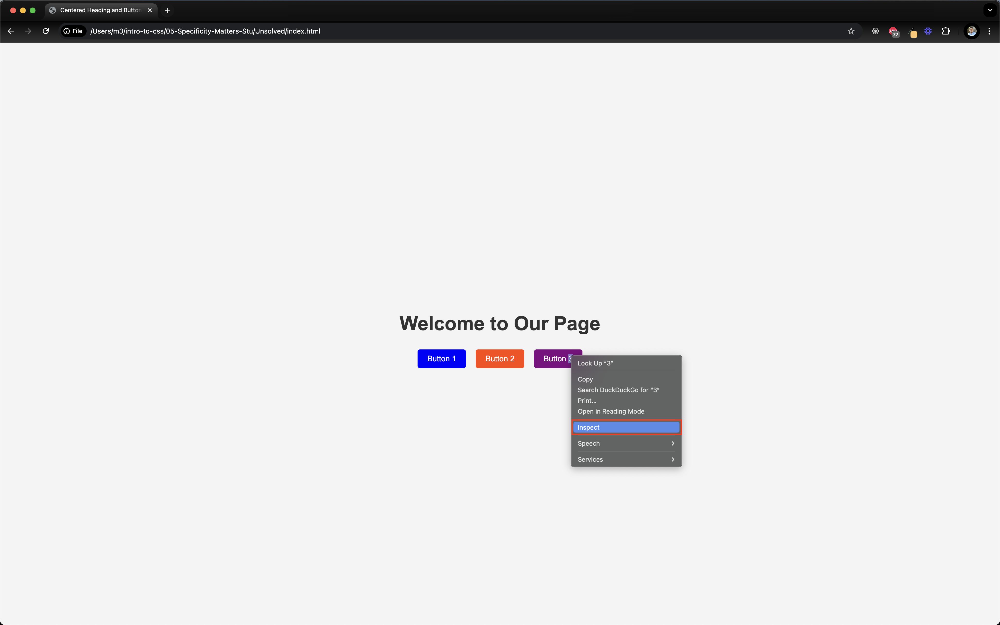
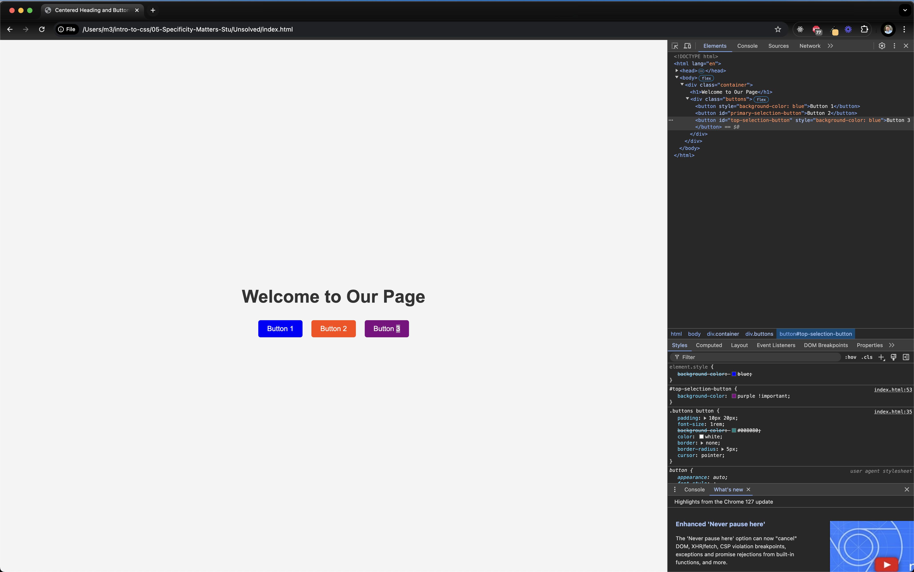

# 06-Chrome-Dev-Tools

This is why the Chrome Developer Tools play such an important role in web development.

To access a specific element using the Chrome Developer Tools, right click on the elemtn you want to inspect and click "Inspect"

Once inside, you can scroll through the various layers of CSS styling for a specific element.

You can also use keyboard shortcuts to open the Console to inspect. 

Mac: CMD+SHIFT+C
Windows: CTL+SHIFT+C

[Chrome Developer Docs](https://developer.chrome.com/docs/devtools/shortcuts/#:~:text=Toggle%20Inspect%20Element%20Mode)