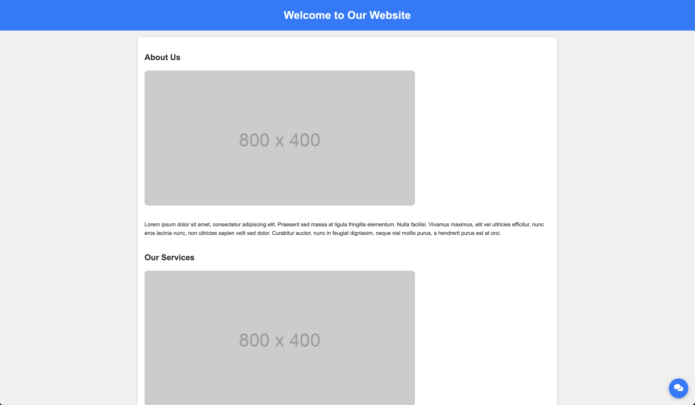
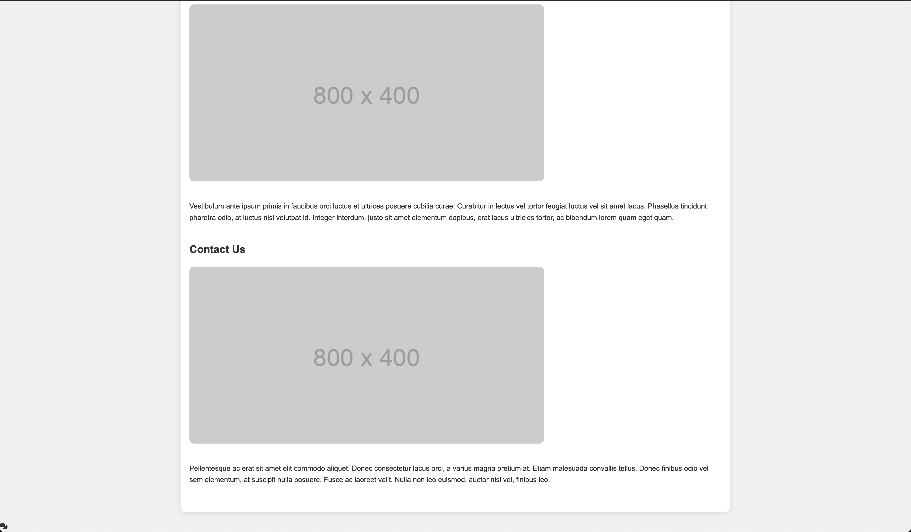

## Layout-Positioning

One of the most common usages for fixed positioning is a chat interaction icon that sticks on the screen as the user scrolls.

## Todo:

1. Fix the broken chat icon by adding CSS to style and position it.

