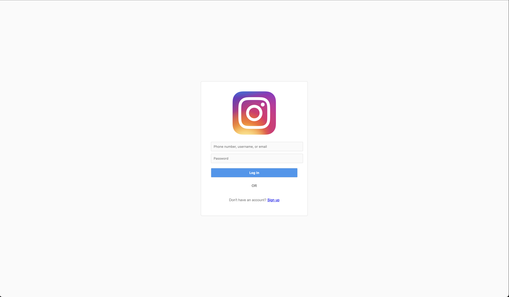

# InstaClone

By now, you've gathered a significant amount of tools to be able to style websites appropriately. This mini-project will require you to use them!

In the provided HTML, you will find the outline for an Instagram Clone login page. Using the provided classes, add styling to make your page look like mine. When finished, it should look like this:

## Todo: 

1. Add styling to make the Instagram Login page match the screenshot!

## Hints:

1. Start with the biggest problems first. (Why is that logo so huge?)
2. Add some basic size constraints.
3. Don't forget things like font.
4. We haven't really styled inputs before. Where could you go to find sample stylings?