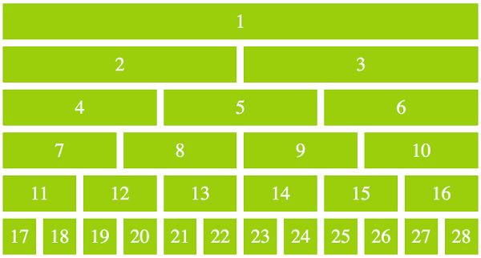

# CSS Grid

In order to style elements in a responsive manner, CSS introduced a Grid concept. 

Each row has 12 columns of width available. 

Elements are sized depending on how many column widths they take up. 

While an element take take 1-12 column widths, they cannot take *more* than 12 column widths. 

If a row has more than 12 column widths of elements, the elements rollover to the next row. 

Fortunately, Bootstrap has adopted this system to allow us to quickly build responsive layouts. 

## Todo:

1. Build a basic HTML page from scratch. 
2. Import Bootstrap
3. Build a page that contains a full-width heading.
4. Add a section where 1/2 is an image and 1/2 is text. 
5. Add a section with three columns of text. 