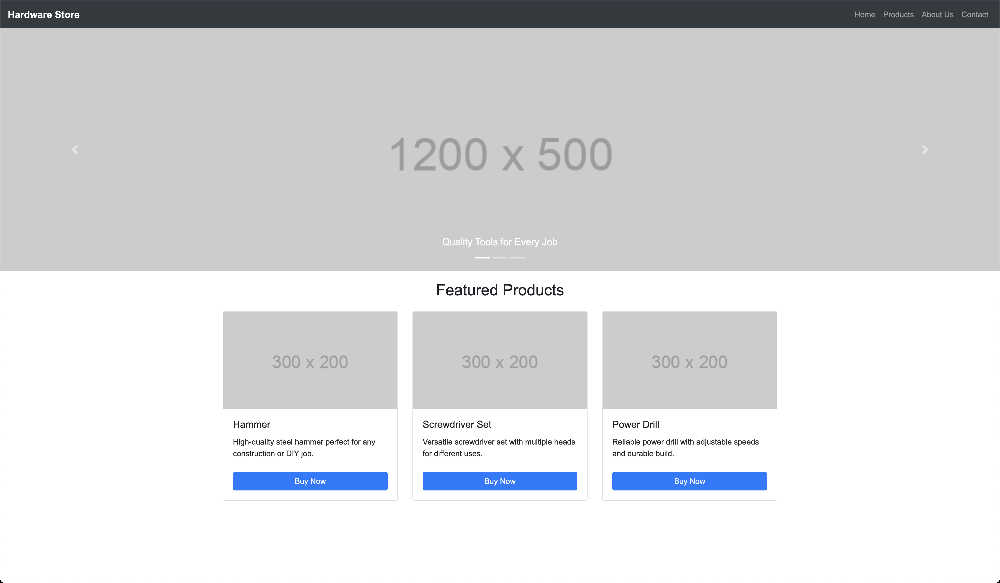

# Bootstrap Grid

Using bootstrap's pre-defined classes and components, fix the provided HTML.

When complete, it should look like the screenshot provided.

## Todo:

1. Look for the Product Listings in the HTML comments.
2. Update the div classes using Bootstrap's pre-defined class names.
3. Each Product card should take up 1/3 of the row.

## Hints:

1. How much is 1/3 of 12 columns?
2. What two other classes must be in the parent tree for column classes to work?
